

<h2> Session 1 (9:00 AM - 10:00 AM) Opening </h2>

    

        
         
        <a href="javascript:void(0)">John Gamble   (IonQ) </a>
        

          
<b>Talk Title: xxxx</b>

          
<b>Speaker Bio:</b> xxxx 

          
<b>Talk Abstract: </b> xxxx

        

    

    

<h2> Session 2 (10:30 AM - 12:00 PM) </h2>

  

      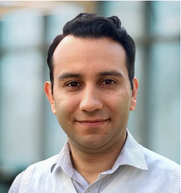
       
      <a href="javascript:void(0)"> Santiago Nuñez-Corrales   (University of Illinois Urbana-Champaign) </a>
      

        
<b>Talk Title: A Prescriptive Definition of Resiliency for Dependable Classical-Quantum Computer Systems Engineering</b>

        
<b>Speaker Bio:</b> Santiago Núñez-Corrales, Ph.D. serves as Quantum Lead Research Scientist at the National Center for Supercomputing Applications (NCSA), University of Illinois Urbana-Champaign (UIUC). He also serves as faculty affiliate at the Illinois Quantum Information Science and Technology Center (IQUIST), the Center for Global Studies (CGS) and Illinois Informatics at the same institution. His expertise includes research computing and quantum programming language design, building digital twins of superconducting quantum devices, devising distributed quantum computation protocols, HPC-QPU integration, and dependable classical-quantum computer systems engineering. Dr. Núñez-Corrales obtained his doctoral degree in Informatics and a minor in Global Studies from UIUC, and a bachelor’s degree in computer engineering from the Costa Rica Institute of Technology.

        
<b>Talk Abstract: </b>As quantum processing units become more affordable and accessible, we will face new challenges during their integration with classical HPC resources. These challenges arise from HPC-QPU integration toward being a socio-technical systems problem well beyond technology stacks; introducing quantum computers into research facilities and data centers involves processes, people and practices. We call this new area Dependable Classical-Quantum Computer Systems Engineering (DCQCES), an emerging body of theory and practice centered on their resiliency, reproducibility and security. In this talk, we will concentrate on resiliency as an property of HPC-QPU systems that can be engineered proactively, instead of reacting to the needs created by technological change across on-premise installation, classical-quantum stack integration, system operations, user support and research consulting. We will discuss how concepts and methods from civil engineering provide a sound qualitative and quantitative definition of resiliency that can be used to understand the impact of unexpected events and engineering decisions across a system, as well as how changes in one level of HPC-QPU technology stacks ripple through layers above and modulate the entire system: we seek to make system classical quantum systems and their operation designable, predictable and measurable tasks. Finally, we delineate the boundaries of DCQCES in terms of community efforts required to develop a coherent research agenda in tandem with the evolution of quantum technologies.

      

  

  

      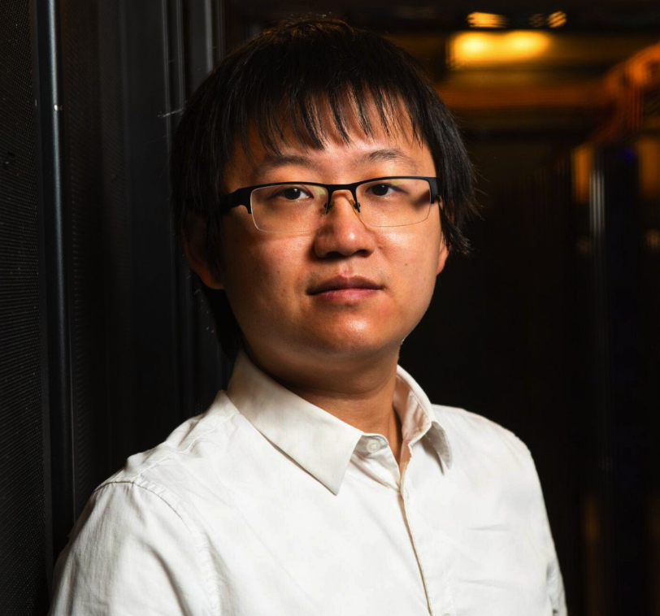
       
      <a href="javascript:void(0)"> Ang Li   (Pacific Northwest National Laboratory) </a>
      

        
<b>Talk Title: xxxx</b>

        
<b>Speaker Bio:</b> 
Dr. Ang Li is a senior computer scientist in the Physical and Computational Sciences  Directorate (PCSD) of Pacific Northwest National Laboratory (PNNL) and Associated Professor with the ECE department of University of Washington (UW) with dual appointment. He received his bachelor degree from the CS department of Zhejiang University, China, in 2010, and two PhD degrees from the Electrical and Computer Engineering (ECE) department of National University of Singapore (NUS), Singapore, and the Electrical Engineering (EE) department of Eindhoven University of Technology (TU/e), The Netherlands, in 2016. He jointed PNNL since Nov, 2016 and dual-appointed with UW ECE since Oct, 2023. His research has been focusing on software-hardware co-design for scalable heterogeneous HPC, particularly GPUs, since 2009. His research covers full-stack design from circuit level up to architecture, system, library, and applications. He has published in major HPC conferences and journals including SC, ICS, PPoPP, IPDPS, HPDC, ASPLOS, MICRO, HPCA, ICPP, CGO, IISWC, EuroPar, TPDS, TC, ICPE, etc. His lead-author work was nominated for best paper award in SC-15, SC-17, IISWC-18 and SC-20. He received the European HiPEAC paper award, and PNNL's PCSD Outstanding Performance award. He served as organizing committee or review committee member for major HPC conferences including PPoPP, SC, ASPLOS, PACT, ISCA, IPDPS, etc. He used to work in industry as a HPC application developer, where he led the evaluation, development, and optimization of several industrial HPC applications. He also worked as a research intern in the INRIA-Lab in Paris-Sud University, France and Chinese University of Hong Kong. 

        
<b>Talk Abstract: </b> xxxx

      

  

  

      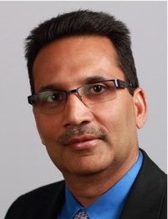
       
      <a href="javascript:void(0)"> Vipin Chaudhary   (Case Western Reserve University) </a>
      

        
<b>Talk Title: Quantum Circuit Cutting and Parallel Job Scheduling</b>

        
<b>Speaker Bio:</b> A veteran of High-Performance Computing and AI, Chaudhary is currently the Kevin J. Kranzusch Chair Professor and Chair of Computer and Data Sciences at CWRU. Previously, as Program Director at National Science Foundation, he was involved with strategic initiatives in Quantum Computing and Artificial Intelligence. Chaudhary co-founded Scalable Informatics, a leading provider of analytics solutions. Previously, he was the CEO of Tata CRL, a global HPC cloud and solutions leader before selling it to Tata Consulting Services. Earlier, at Cradle Technologies, he developed multi-processor chips and software for media applications and served as Chief Architect at Corio Inc. His current research interests are in AI and Quantum Computing.

        
<b>Talk Abstract: </b> As quantum computers evolve, the increasing number of qubits offers great potential for more complex computations. However, high error rates continue to limit the size of quantum circuits that can be reliably executed, leading to low throughput and inefficient resource utilization. This talk will explore two complementary strategies to address these limitations: quantum circuit cutting and parallel quantum job scheduling.

      

  

 
 

<h2> Session 3 (1:00 PM - 3:00 PM) </h2>

  

      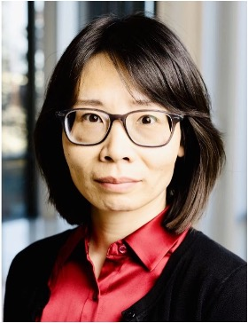
       
      <a href="javascript:void(0)"> Fan Chen   (Indiana University Bloomington) </a>
      

        
<b>Talk Title: Advancing Quantum Neural Networks in the NISQ Era </b>

        
<b>Speaker Bio:</b> Fan Chen is an assistant professor in the Department of Intelligent Systems Engineering at the Indiana University Bloomington. Her research interests include Quantum Computing, Environmentally Sustainable Computing, and Hardware Acceleration for Emerging Applications. Dr. Chen is a recipient of the 2022 NSF CAREER Award, the 2019 Cadence Women in Technology Scholarship. Her research has won the Best Paper Finalists at DAC 2024, the Best Paper Award (3rd Place) at QCE 2023, the Best Paper Award and the Ph.D. forum Best Poster Award at ASP-DAC 2018. Her contributions to the research community have been acknowledged by the 2024 SIGDA Meritorious Service Award, the 2022 Best Associate Editor of IEEE CAS Magazine, and the 2021 Service Recognition Award of GLSVLSI.

        
<b>Talk Abstract: </b> Quantum Neural Networks (QNNs) represent a promising class of Noisy Intermediate-Scale Quantum (NISQ) algorithms with transformative potential across various domains. However, their effective implementation must address inherent quantum noise throughout the system stack.  In this talk, I will present our research group’s efforts to enhance QNN performance by tackling these noise challenges through advancements in algorithm design, compilation, and model training, focusing on key metrics such as accuracy, fairness, and security. I will begin by discussing robust QNN algorithm designs, including supervised, unsupervised, and transfer learning models. Next, I will introduce our automated QNN compilation framework, which ensures fairness and accuracy when deploying QNNs on NISQ machines. Finally, I will explore adversarial threats to QNNs, specifically backdoor attacks implanted during QNN training, along with potential defense strategies. Throughout the talk, I will share key techniques, insights, and lessons learned from each project, with the goal of advancing more resilient and secure QNNs.

      

  

  

      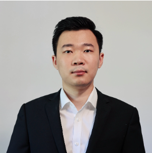
       
      <a href="javascript:void(0)"> Ji Liu   (Argonne National Laboratory) </a>
      

        
<b>Talk Title: Enhancing Quantum Error Mitigation with Circuit Cutting </b>

        
<b>Speaker Bio:</b> Ji Liu is an Assistant Computer Scientist at Argonne National Laboratory. His research interests include developing open-source software stacks for quantum compiler optimizations, application/hardware-specific optimization techniques, and advanced noise mitigation techniques for NISQ systems. He received the Distinguished Artifact Award at HPCA 2022 for his work on qubit routing, and his QuTracer framework for error mitigation was a Best Paper Finalist at ISCA 2024. 

        
<b>Talk Abstract: </b> Quantum error mitigation is crucial in the current noisy intermediate-scale quantum (NISQ) era. As we strive for practical quantum advantage in the near term, it has become an indispensable component. While various error mitigation techniques have been proposed, many rely on error detection or measurement subcircuits that introduce additional noise, limiting their effectiveness. On near-term devices with limited qubit connectivity, the extra swaps needed further increase the noise associated with these error mitigation subcircuits. In this talk, we will explore approaches that utilize circuit cutting to simulate error mitigation subcircuits classically. This allows for near-ideal execution of the subcircuits, reducing additional noise and enhancing overall performance. Specifically, we will present techniques applied to Pauli check sandwiching, virtual distillation, and QuTracer—an error mitigation framework based on qubit subsetting. We will demonstrate how these methods can significantly improve error mitigation on NISQ devices. 

      

  

  

      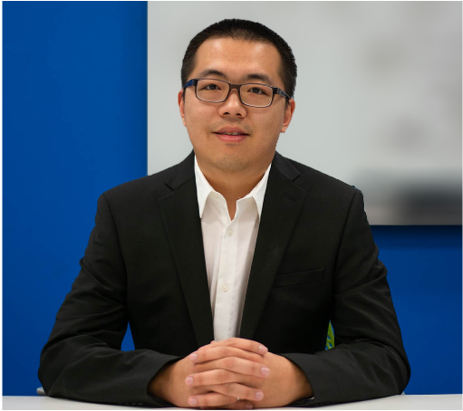
       
      <a href="javascript:void(0)"> Xulong Tang   (University of Pittsburgh) </a>
      

        
<b>Talk Title: Toward High-Fidelity, Scalable, and Accessible Quantum Computing Systems </b>

        
<b>Speaker Bio:</b> Dr.Xulong Tang is an Assistant Professor in the Computer Science Department at the University of Pittsburgh. He received his Ph.D. degree from the Pennsylvania State University in 2019. His current research focuses on: i) designing next-generation GPU architectures and systems, ii) exploring efficient edge computing, and iii) advancing quantum computing systems. His work has been published in top-tier venues including MICRO, HPCA, ISCA, ASPLOS, PLDI, etc. You can find out more about him at https://xzt102.github.io/. 

        
<b>Talk Abstract: </b> Quantum computers have demonstrated quantum advantages over classical computers in various tasks. However, the current Noisy Intermediate-Scale Quantum (NISQ) quantum era encounters challenges arising from i) Noisy system with high error rates, ii) limited scalability of quantum systems for large algorithms, and iii) lack of access to practical quantum hardware. In this talk,  I will discuss our recent works targeting these challenges that make efforts towards high-fidelity, scalable, and accessible quantum computing systems. Specifically, I will introduce i) a compilation framework that performs quantum gate orchestration to reduce the noise and execution time in photonic quantum computing, ii) a circuit-cutting algorithm to partition a given circuit into smaller sub-circuits with improved fidelity, and iii) a quantum circuit emulation framework that leverages high-performance computing resources to efficiently simulate given quantum circuits. 

      

  

  

      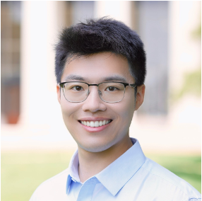
       
      <a href="javascript:void(0)"> Hanrui Wang   (University of California, Los Angeles) </a>
      

        
<b>Talk Title: Software Stack for Reconfigurable Neutral Atom Quantum Computing </b>

        
<b>Speaker Bio:</b> Hanrui Wang is an incoming Assistant Professor at UCLA Computer Science. He received his PhD degree from MIT EECS advised by Song Han. His research focuses on efficient AI and Quantum Computing. His work has been recognized by ACM SRC 1st Place Award, Best Poster Award at NSF AI Institute, Best Paper Award at QCE, and Best Paper Award at ICML RL4RL. He is the recipient of the Qualcomm Fellowship, Unitary Fund, Nvidia Fellowship Finalist, Rising Star in ML and Systems, and Rising Star in ISSCC. He is the creator of TorchQuantum library which has been adopted by IBM and PyTorch Ecosystems, and the co-founder of QuCS lecture series for quantum education. He received a B. Eng. degree with honors from Fudan University. 

        
<b>Talk Abstract: </b> Neutral atom arrays are gaining traction in quantum computing for their scalability, particularly with the advent of reconfigurable atom arrays (RAAs) or field programmable qubit arrays (FPQAs), which allow atom movement during circuit execution. This talk presents two contributions leveraging this architecture to enhance quantum circuit performance. First, Atomique is a compilation framework for RAAs, optimizing qubit mapping, atom movement, and gate scheduling. Using MAX k-Cut for qubit placement and parallel gate scheduling, Atomique reduces circuit depth and two-qubit gates across diverse benchmarks compared to fixed atom arrays and superconducting systems. Second, Q-Pilot introduces flying ancillas—movable atoms used as dynamic ancilla qubits—to optimize qubit connectivity in FPQAs. Inspired by FPGA routing, Q-Pilot achieves significant depth reductions, particularly in quantum simulation and QAOA circuits. These works highlight the potential of RAAs and FPQAs in enabling more efficient and reliable quantum computation through dynamic qubit connectivity. 

      

  

<h2> Session 4 (3:30 PM - 5:00 PM) </h2>

  

      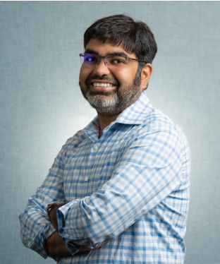
       
      <a href="javascript:void(0)"> Kanad Basu   (University of Texas at Dallas) </a>
      

        
<b>Talk Title: Crosstalk-induced Side Channel Threats in Multi-Tenant NISQ Computer </b>

        
<b>Speaker Bio:</b> Kanad Basu received his Ph.D. from the department of Computer and Information Science and Engineering, University of Florida. Kanad worked in various semiconductor companies like Intel, IBM and Synopsys. Currently, Kanad is an Assistant Professor at the Electrical and Computer Engineering Department of the University of Texas at Dallas, where he leads the Trustworthy and Intelligent Embedded Systems (TIES) lab. Prior to this, Kanad was an Assistant Research Professor at the Electrical and Computer Engineering Department of NYU. He has authored 1 book, 2 US patents, 2 book chapters and several peer reviewed journal and conference articles. Kanad has won the “Outstanding Assistant Professor Award” by the Erik Jonsson School of Engineering, UT Dallas in 2024. His research has been awarded as IEEE Top Picks in Test and Reliability in 2023 and 2024. Moreover, Kanad was awarded the “Best Paper Award” at the International Conference on VLSI Design 2011 and an “Honorable Mention Award” at the same conference in 2021. Kanad has mentored student teams at UT Dallas that won various international hardware hacking competition, including HACK@DAC and NYU CSAW. Several News agencies have covered his research including NBC Austin and CBS Dallas-Fort Worth. Kanad’s current research interests are reliable and secure computing systems, including quantum computing systems. His research is currently funded by NSF, SRC, Intel, TII, etc. 

        
<b>Talk Abstract: </b> As quantum computing rapidly advances, its near-term applications are becoming increasingly evident. However, the high cost and under-utilization of quantum resources are prompting a shift from single-user to multi-user access models. In a multi-tenant environment, where multiple users share one quantum computer, protecting user confidentiality becomes crucial. The varied uses of quantum computers increase the risk that sensitive data encoded by one user could be compromised by others, rendering the protection of data integrity and confidentiality essential. In the evolving quantum computing landscape, it is imperative to study these security challenges within the scope of realistic threat model assumptions, wherein an adversarial user can mount practical attacks without relying on any heightened privileges afforded by physical access to a quantum computer or rogue cloud services. In this talk, we demonstrate the potential of crosstalk as an attack vector for the first time on a Noisy Intermediate Scale Quantum (NISQ) machine, that an adversarial user can exploit within a multi-tenant quantum computing model. The proposed side-channel attack is conducted with minimal and realistic adversarial privileges, with the overarching aim of uncovering the quantum algorithm being executed by a victim. Crosstalk signatures are used to estimate the presence of CNOT gates in the victim circuit, and subsequently, this information is encoded and classified by a graph-based learning model to identify the victim quantum algorithm. When evaluated on up to 336 benchmark circuits, our attack framework is found to be able to unveil the victim's quantum algorithm with up to 85.7% accuracy.

      

  

  

      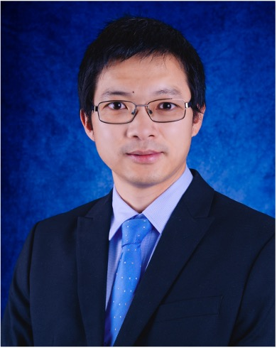
       
      <a href="javascript:void(0)"> Yu Zhang   (Los Alamos National Laboratory) </a>
      

        
<b>Talk Title: Quantum Information Informed Quantum Algorithms </b>

        
<b>Speaker Bio:</b> Yu Zhang received his BSc in Physics from Sun Yat-Sen University in 2010 and his Ph.D. in Chemical Physics from The University of Hong Kong in 2015. From 2015 to 2017, he worked as a Postdoctoral Fellow at Northwestern University. Yu joined Los Alamos National Laboratory (LANL) in 2018 as a Director's Postdoctoral Fellow and transitioned to a staff member in 2019. He is the recipient of the Laboratory Directed Research and Development (LDRD) Early Career Research Award (2022) and the DOE Office of Science Early Career Research Award (2023). Yu's research lies at the intersection of chemical physics and quantum physics, with a focus on developing and applying theoretical models and computational methods to explore the electronic and optical properties of nanomaterials, for implications for sustainable energy and quantum technologies. Yu’s current interests include quantum computation, quantum information science, light-matter interactions, open quantum systems, and non-adiabatic dynamics. 

        
<b>Talk Abstract: </b> Quantum computing presents promising solutions for electronic structure and excited state problems, yet traditional methods like the Variational Quantum Eigensolver (VQE) encounter difficulties such as deep quantum circuits and optimization challenges for quantum chemistry problems. In this talk, I present quantum information-informed algorithms that significantly enhance the efficiency of quantum chemistry calculations by reducing the circuit complexity. The PermVQE approach leverages quantum information to optimize qubit permutations to localize correlations, thereby reducing circuit depth and improving noise resilience. ClusterVQE utilizes mutual information and graph theory to partition qubit space into entangled clusters, enabling precise simulations of larger systems with fewer qubits. Finally, the Quantum Davidson algorithm extends the quantum Krylov subspace method, employing a pre-conditioned iterative expansion that accelerates convergence on excited states with shallower circuits. 

      

  

  

      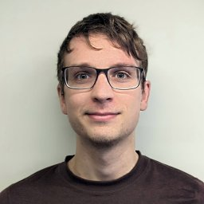
       
      <a href="javascript:void(0)"> Evan McKinney   (University of Pittsburgh) </a>
      

        
<b>Talk Title: Towards Error Budgeting for Superconducting Modular Quantum Architecture Designs </b>

        
<b>Speaker Bio:</b> xxxx 

        
<b>Talk Abstract: </b> —This paper addresses frequency crowding constraints in modular quantum architecture design, focusing on the SNAIL-based quantum modules. Two key objectives are explored. First, we present physics-informed design constraints by describing a physical model for realizable gates within a SNAIL module and building a fidelity model using error budgeting derived from device characteristics. Second, we tackle the allocation problem by analyzing the impact of frequency crowding on gate fidelity as the radix of the module increases. We explore whether the gate fidelity can be preserved with a discrete set of qubit frequencies while adhering to defined separation thresholds. This work offers insights into novel quantum architectures and coupled optimization techniques to mitigate the effects of unstable noise and improve overall gate performance. 

      

  

  

      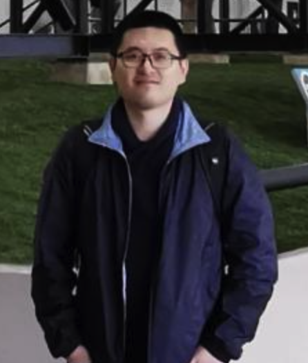
       
      <a href="javascript:void(0)"> Fang Qi   (Tulane University) </a>
      

        
<b>Talk Title: PruningQC: Boosting the Quantum Computation Fidelity by Pruning Redundant Gates </b>

        
<b>Speaker Bio:</b> xxxx 

        
<b>Talk Abstract: </b> Quantum computing offers promise for solving problems beyond classical capabilities, but its effectiveness is hindered by noise and high error rates in superconducting quantum computers. These issues, exacerbated by nearest-neighbor connectivity, necessitate extensive routing, leading to decoherence and multiple swap operations. We introduce PruningQC, a novel method that optimizes circuit efficiency by removing redundant gates in measurement subsetting, reducing noise, and minimizing circuit depth. By selectively measuring specific qubits, PruningQC identifies and eliminates dispensable gates without affecting outcomes, thereby enhancing quantum computing performance. Evaluations on three IBM 127-qubit machines show that PruningQC improves success rates by an average of 17.5 times over full measurement methods and 2.1 times over partial measurement techniques. This improvement is due to a 50% reduction in circuit depth and a significant decrease in gate counts. PruningQC can also be integrated with quantum error correction strategies, advancing quantum computing efficiency. 

      

  

